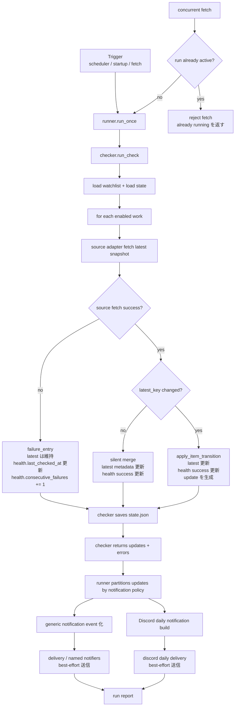

# 設計書

## 1. 目的

本設計書は、`comic_crawler` の実装方式を定義する。  
本書は、別紙の要件定義書および受け入れ仕様書（`SPEC.md`）で定義された外部契約を満たすために、システム内部の責務分割、データ構造、永続化方式、通知方式、障害処理方式、および試験支援方針を整理することを目的とする。

本設計書の主眼は以下とする。

- 外部契約を満たすための内部構成を明確にする
- state 安全性を最優先にした永続化設計を定義する
- `latest` / Daily notification / run report の生成責務を分離する
- orchestration と delivery を分離し、障害切り分けを容易にする
- AI 主体の実装・保守に耐えるよう、責務境界と変更可能範囲を明確にする

---

## 2. 設計方針

本設計では、以下の方針を採用する。

### 2.1 外部契約と内部方式の分離
- `latest`、Daily notification、run report、`fetch` の外部契約は `SPEC.md` を正とする
- 本設計書では、その契約を満たすための内部構造のみを定義する
- 外部契約に影響しない内部改善は、原則として本設計書の範囲で変更可能とする

### 2.2 state 安全性の最優先
- state は異常終了時にも JSON として読めることを最優先とする
- reader から見て壊れた状態や途中状態を露出しない
- 同時実行が起きても、少なくとも読めない state を作らない

### 2.3 責務分割
- 更新検知
- run orchestration
- 通知 delivery
- Discord surface
- persistence
を分離する

### 2.4 モック検証を主、実機検証を従
- 主要品質保証はモックベース自動試験で行う
- Discord 実機検証は補助的な自動 E2E とする
- テスト容易性を損なう実装は避ける

---

## 3. アーキテクチャ概要

システムは以下の論理コンポーネントで構成する。

1. **watchlist loader**
   - watchlist v2 を読み込む
   - 入力順を保持する

2. **state store**
   - state v2 の読込と保存を担当する
   - durability と可読性を保証する

3. **checker**
   - watchlist を巡回し、最新話 snapshot を取得する
   - `latest_key` 変化の有無を判定する
   - source failure / run failure を区別して返す

4. **notification decision**
   - 更新イベントが通知対象かを判定する
   - policy と classification を適用する

5. **message builders**
   - `latest` response builder
   - Daily notification builder
   - run report builder
   を分離して持つ

6. **runner**
   - run の開始、checker 実行、state 反映、通知生成、report 生成を統括する
   - delivery 実行結果をまとめる

7. **delivery**
   - backend fan-out
   - delivery failure の集約

8. **Discord adapter**
   - inbound message の解釈
   - outbound message の送信
   - `latest` / `fetch` surface を担当する

---

## 4. コンポーネント責務

## 4.1 checker
checker は作品単位の最新状態取得と更新検知を担当する。

責務:
- watchlist 順で作品を処理対象として扱う
- source adapter を用いて作品の最新 snapshot を取得する
- `latest_key` の変化で更新を検知する
- metadata 改善のみの場合は silent merge 判定を行う
- source failure と run-level failure を区別して結果を返す
- 成功作品と失敗作品が混在しても、成功分の処理継続を可能にする

非責務:
- Discord 送信
- backend fan-out
- retry/backoff の詳細な delivery 制御
- ユーザー向け文面整形

---

## 4.2 runner
runner は run 全体の orchestration を担当する。

責務:
- 定期 run / startup run / `fetch` run の入口を統一する
- watchlist/state の読み込みを行う
- checker を実行する
- state 更新結果を永続化する
- Daily notification 用入力を生成する
- run report 用入力を生成する
- delivery に通知要求を渡す
- run の trigger source を保持する
- run 全体の成功/失敗/部分失敗を集約する

非責務:
- 個別 backend 送信
- retry/backoff アルゴリズム
- Discord inbound command parsing の細部
- state ファイルフォーマットの細かな解釈

---

## 4.3 delivery
delivery は通知送信を担当する。

責務:
- notification event を backend ごとに送信する
- failure を runner に返す
- best-effort delivery を維持する
- success / partial failure / total failure を runner に返す

非責務:
- 更新検知
- state の差分判定
- 通知文面の生成
- `latest` query の応答生成

---

## 4.4 Discord adapter
Discord adapter は Discord 特有の surface を扱う。

責務:
- inbound message を `latest` / `fetch` に振り分ける
- `latest` は read-only surface として扱う
- `fetch` は run 起動トリガーとして扱う
- 初期応答や受理反応を返す
- outbound で Daily notification / run report / `latest` response を送る

非責務:
- checker の更新判定
- 永続化詳細
- backend fan-out の一般化

---

## 4.5 state store
state store は state v2 の読込と保存を担当する。

責務:
- state JSON を読み込む
- state JSON を安全に保存する
- reader から破損状態が見えないようにする
- concurrent access 時にも最低限の可読性を保つ

非責務:
- 更新判定
- ユーザー向けメッセージ生成
- source adapter の実行

---

## 4.6 update / state / notification flow
`update` は checker が生成し、runner が通知入力として受け渡す。
`latest` / `health` は checker が state に反映する作品状態であり、通知 delivery とは別レイヤで扱う。

補足:
- `update` は `latest_key` が変わった作品だけに対して checker が返す差分であり、runner はこれを通知入力として使う
- `health` は source fetch の健全性を表し、delivery success / failure は含まない
- delivery failure が起きても `latest` / `health` は巻き戻さない
- 同時 `fetch` は reject し、単一の run だけが write path に入る

---

## 5. データモデル

## 5.1 watchlist v2
watchlist v2 は runtime の入力データであり、以下の役割を持つ。

- 監視対象作品一覧を保持する
- 表示順および処理順の基準を与える
- 各作品の `work_id`、`source`、`seed_url` を保持する
- 各作品の enabled / notification mode / health policy を保持する

設計上の注意:
- watchlist 順は `latest` / updates / Daily notification の順序基準とする
- duplicate 判定は `work_id` 単位とする
- `enabled=false` は checker の巡回対象から外してよい
- `enabled=false` は `latest` 一覧の既定表示対象から外す

---

## 5.2 state v2
state v2 は runtime の正規永続状態であり、以下を保持する。

- 各 `work_id` の最新 snapshot
- health 状態
- 全体の最終 run 時刻

state v2 は JSON 文書として保存する。  
reader から見て、常に一貫した JSON であることを保証対象とする。

---

## 5.3 work state
各作品単位の state は概念上、以下の要素から成る。

- `latest`
  - 現在の最新 snapshot
- `health`
  - 最終巡回・最終成功・連続失敗回数

設計方針:
- 更新検知の主キーは `latest.latest_key`
- metadata 改善のみは `latest_key` 不変のまま silent merge する
- health は run report および stale / failure 判定の基礎情報とする

項目ごとの意味:
- `latest`
  - 現在比較対象に使う最新 snapshot
- `health`
  - source fetch が最後にいつ試行され、いつ成功し、何回連続失敗したか
  - status / stale / broken 判定の基礎データ
  - notification delivery の成功可否とは独立である

---

## 6. 更新検知設計

## 6.1 更新判定キー
更新検知の唯一比較キーは `latest_key` とする。

設計意図:
- タイトルや表示ラベルの改善で通知が再発しないようにする
- source ごとの差異を吸収し、比較ルールを単純化する
- Daily notification の dedupe と state 差分判定を同じ軸にする

---

## 6.2 silent merge
`latest_key` が不変で、表示ラベルや補足情報のみが改善された場合は silent merge とする。

設計意図:
- ユーザーには同一話として扱う
- state 品質は上げる
- ただし Daily notification は発火させない

silent merge の例:
- `episode_title` の改善
- `series_title` の補完
- URL 正規化
- metadata 補足の改善

---

## 6.3 dedupe
同一話の再通知防止は `work_id + latest_key` を基準とする。

設計意図:
- source ごとの表記揺れや metadata 差分を吸収する
- `fetch` / scheduled いずれでも同一ルールを適用できる

---

## 6.4 notification decision
更新イベントが通知対象かどうかは、classification と policy を組み合わせて判定する。

設計方針:
- classification default を持つ
- watchlist の policy により最終通知可否を決定する
- policy は mode のみを持つ単純な形に寄せる
- suppressed update も state と run report には残しうる

実装詳細:
- classification 衝突時のルール
- validation error
- unknown 扱い
は別節または詳細設計に定義する

---

## 7. 永続化設計

## 7.1 基本方針
state 永続化は、以下を満たすよう設計する。

- 異常終了時にも JSON として壊れない
- reader に中間状態を見せない
- replace 単位で新旧どちらかが見える
- concurrent read に対して parse error を起こさない

---

## 7.2 atomic write
state 保存は、最終的に atomic replace ベースで行う。

実装の意図:
- 部分書き込み済み state を公開しない
- flush / fsync を通じて durability を高める
- 異常終了時に broken JSON が残らないようにする

具体手順の例:
1. temp file へ書き込む
2. flush する
3. fsync(file) する
4. replace する
5. fsync(directory) する

注記:
- 具体手順は実装プラットフォーム制約に応じて調整可能とする
- ただし受け入れ条件は「JSON として壊れないこと」を優先する

---

## 7.3 reader visibility
reader は state ファイルに対して以下を期待できる。

- 読み込み時に parse 可能な JSON である
- 途中書き込み状態を観測しない
- 異常終了時も旧 state または新 state のいずれかとして扱える

---

## 7.4 concurrent write control
write path は単一 run に制限する。

方針:
- run 中の追加 `fetch` は reject する
- scheduler / startup / `fetch` のいずれであっても、同時に複数の write path を走らせない
- それでも異常系で重複起動した場合に備え、reader visibility は損なわないこと

---

## 8. 通知設計

## 8.1 message builder 分離
ユーザー向け文面生成は、用途ごとに builder を分ける。

- `LatestMessageBuilder`
- `DailyNotificationBuilder`
- `RunReportBuilder`

分離理由:
- 契約が異なる
- テスト観点が異なる
- 文面ルールが異なる
- 変更影響を局所化しやすい

---

## 8.2 `latest` response builder
責務:
- 保存済み state のみから一覧を作る
- watchlist 順で出力する
- fallback ルールを適用する
- truncation ルールを適用する
- stale / partial failure warning を組み立てる

---

## 8.3 Daily notification builder
責務:
- 更新イベント列を 1 通または複数通の通知本文へ変換する
- watchlist 順を保つ
- `to` / `from` の表示ルールを適用する
- truncate / fallback を適用する
- silent merge は入力段階で除外される想定とする

---

## 8.4 run report builder
責務:
- run の意味を要約する
- 更新なし / run failure / delivery failure を区別可能に表現する
- 実行時刻、trigger source、更新件数、failure 要約、状態要約を含める

方針:
- 受け入れは意味で行う
- 文面詳細は builder 実装に委ねる

---

## 8.5 delivery backend
delivery backend は少なくとも以下を想定する。

- stdout
- webhook
- Discord surface 専用送信

方針:
- backend の success/failure を個別に観測する
- 一部成功 / 一部失敗を許容する
- partial failure は run report で可視化する
- durable な再送キューは持たない

---

## 9. 障害処理設計

## 9.1 source failure
source adapter 単位の failure は、作品単位 failure として扱う。

例:
- timeout
- HTTP 429
- HTTP 5xx
- parse failure
- unsupported URL
- HTTP 404

方針:
- failure していない作品の処理は継続する
- state の health は更新する
- run report で可視化する

---

## 9.2 run-level failure
watchlist 読込失敗、state 保存失敗など、run 全体に関わる failure は run-level failure として扱う。

方針:
- source failure と分けて記録する
- run report で区別可能にする
- 更新なしと混同しない

---

## 9.3 delivery failure
通知 delivery の失敗は、更新検知の失敗とは分けて扱う。

方針:
- 更新検知済みであることは保持する
- run report で「更新ありだが delivery failure」と分かるようにする
- 同一更新の durable な再送は要求しない

---

## 9.4 error visibility
障害時には、以下が分かることを重視する。

- どの層で失敗したか
- 更新なしとの違い
- 再試行可能か
- 秘匿情報を含まないこと

---

## 10. Discord surface 設計

## 10.1 inbound command routing
Discord inbound は trim 後の本文一致で `latest` / `fetch` を解釈する。

方針:
- command routing は単純で決定的にする
- 曖昧な解釈は避ける
- read-only と write path を明確に分ける

---

## 10.2 ack / initial response
Discord への初期応答は、利用者が受理を把握できるようにする。

方針:
- `latest` / `fetch` ともに 3 秒以内を目標とする
- `fetch` は受理を伝えた上で、詳細結果は Daily notification / run report に委ねてよい
- `latest` は保存済み state の応答本体を返す

---

## 10.3 実機自動確認
Discord 実機確認は補助的な自動 E2E として設計する。

最小要件:
- 専用 test guild / test channel を用いる
- 投稿内容を取得して期待構造を比較できる
- 本番チャネルと分離する
- flaky / rate limit の影響で主受け入れ判定からは分離する

---

## 11. テスト支援設計

## 11.1 モックベース試験
主たる受け入れ判定はモックベース自動試験で行う。

対象:
- formatter
- orchestration
- delivery failure handling
- state persistence
- security masking

---

## 11.2 persistence safety tests
state 安全性を担保するため、異常終了・並列読込・並列実行を模した試験を用意する。

目的:
- JSON 完全性
- reader visibility
- concurrent access 耐性

---

## 11.3 Discord mocked integration tests
Discord API をモックし、以下を検証する。

- payload 構造
- channel routing
- failure 可視化
- `latest` / Daily notification / run report の構造契約

---

## 11.4 Discord real E2E harness
補助的な回帰検知として、実機送信ベースの E2E harness を用意する。

対象:
- 代表ケースの投稿
- 改行
- markdown link
- 全角記号
- 表示順
- 想定外 mention 非発生

位置づけ:
- 主受け入れではない
- 回帰検知または smoke

---

## 12. モジュール分割の推奨

推奨される論理分割は以下とする。

- `manga_watch.watchlist`
- `manga_watch.state_store`
- `manga_watch.checker`
- `manga_watch.notification_policy`
- `manga_watch.builders.latest`
- `manga_watch.builders.daily_notification`
- `manga_watch.builders.run_report`
- `manga_watch.delivery`
- `manga_watch.runner`
- `manga_watch.discord_adapter`

目的:
- 契約単位で変更影響を閉じ込める
- テスト対象を明確にする
- AI 実装時の責務混線を避ける

---

## 13. 設計上のトレードオフ

### 13.1 `fetch` 同時実行を reject する代わりに write path を単純化する
- 同時 write を避けることで state 管理と説明を単純化する
- その代わり利用者には retry を求める

### 13.2 run report の文面固定を緩める代わりに意味契約を守る
- 柔軟性を残す
- ただし「更新なし / 失敗 / delivery failure」の区別は必須

### 13.3 Discord 実機確認を補助扱いにする
- 受け入れ主判定の安定性を優先する
- 実表示差異は補助 E2E で拾う

### 13.4 性能を benchmark 扱いにする
- 実装の成熟に応じて強化しやすくする
- ただし劣化が見えなくならないよう、継続測定は必要

---

## 14. 実装時の注意点

- `latest` の処理経路で source fetch を呼ばないこと
- Daily notification の入力から silent merge を除外すること
- `work_id + latest_key` を跨いで dedupe 判定をずらさないこと
- state 保存で途中状態を公開しないこと
- secret をログ整形前にマスクできるようにすること
- builder が state / source adapter に直接依存しないこと
- runner が delivery の細部を抱え込みすぎないこと
- 同時 `fetch` reject の判定を write path 入口で一貫して行うこと

---

## 15. 今後の詳細化ポイント

- concurrent write の具体方式
- run 中 `fetch` reject の UI / 文面
- Discord E2E harness の実行環境
- benchmark の自動運用方法
- health state の表示ルール詳細

---
